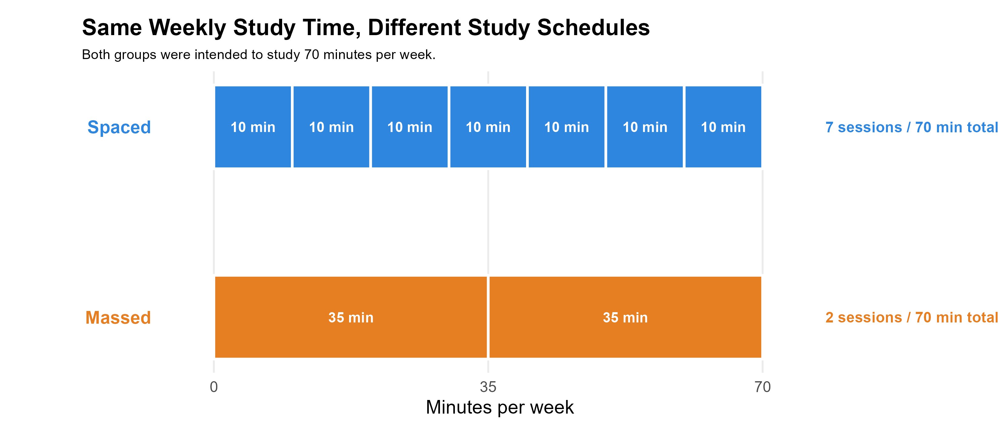

## Is a little bit every day really better than a lot at once?

Language-learning apps often encourage daily practice with streaks and reminders. But if two learners spend the same amount of time each week, does it matter how that time is distributed?

This project explores that question using an 8-week Duolingo learning study.

## Same Study Time, Different Routines

We compared two study schedules:

- **Spaced practice**: 7 sessions × 10 minutes  
- **Massed practice**: 2 sessions × 35 minutes  

Both groups aimed for <b>70 minutes per week</b>, but distributed differently.

{width=80%}

## What Do These Duolingo Terms Mean?

{width=40px}**Session**  
A study period recorded in the learning log.

{width=40px}**Lesson**  
A completed Duolingo activity.

{width=40px}**XP**  
Experience points reflecting in-app activity.

{width=40px}**Streak**  
Consecutive days of completing lessons.

{width=40px}**Leaderboard**  
Ranking system based on XP.

## Swedish Course Structure

The Swedish course contains **4 sections and 85 units**, ranging from introductory content to A2-level material.

👉 Go to **Results** to see what actually happened.