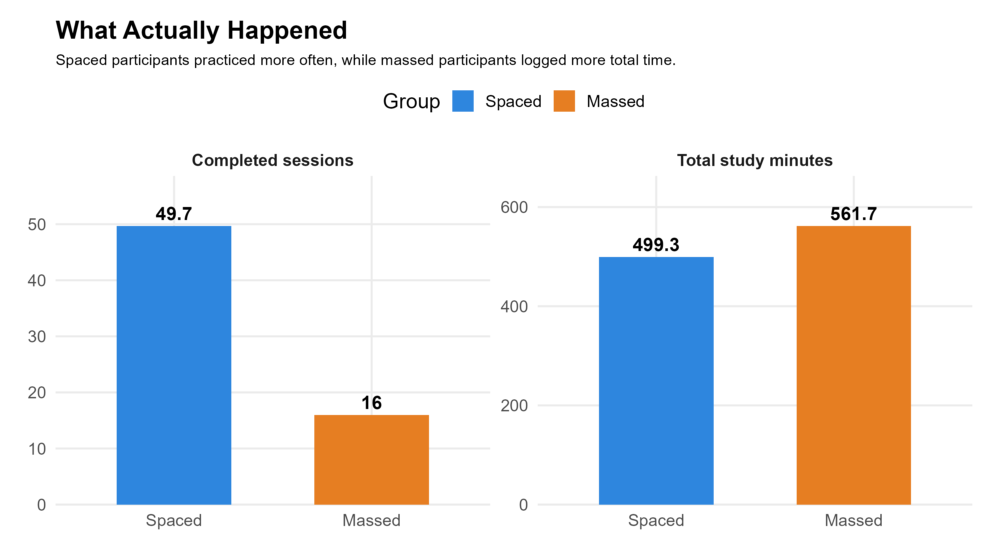
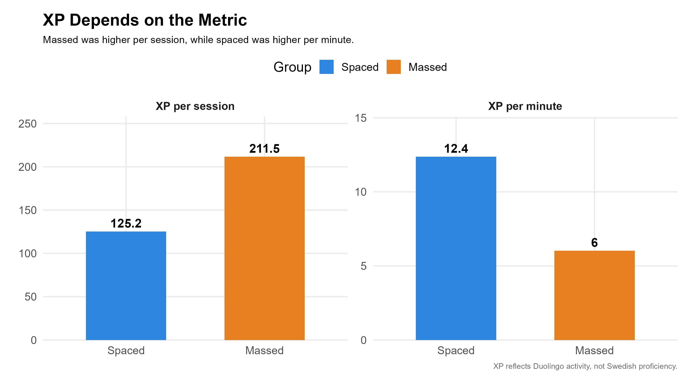
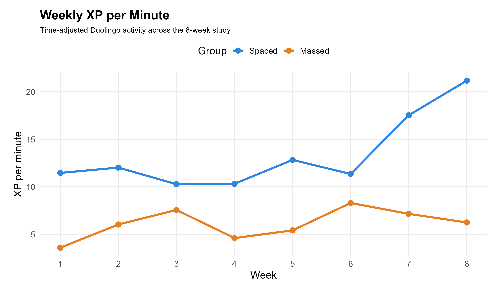
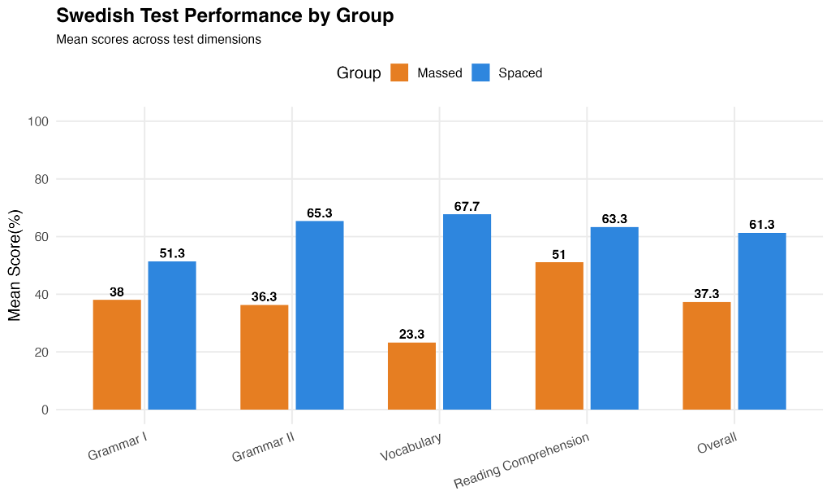

## What Actually Happened?

The schedules worked differently in practice.

<ul>
<li>The spaced group studied more frequently</li>
<li>The massed group logged more total study time</li>
</ul>

{width=80%}

Because total study time was not perfectly balanced, the results should be interpreted as **descriptive patterns**, not a strict test of spacing alone.

## XP Results

XP told two different stories.

<ul>
<li>Massed shows higher XP per session</li>
<li>Spaced shows higher XP per minute</li>
</ul>

{width=80%}

XP reflects app activity, not language proficiency.

## Weekly Engagement

Study behavior changed over time.

{width=80%}

A good study routine needs to be sustainable, not just effective on a single day.

## Test Results

Participants completed a Swedish proficiency test with four sections:

- Grammar I  
- Grammar II  
- Vocabulary  
- Reading  

### Overall

- Highest performance: **Reading (57.2%)**
- Overall mean: **49.3%**

### By Group

<ul>
<li>The spaced group outperformed the massed group across all dimensions</li>
<li>The advantage was especially strong in vocabulary</li>
</ul>

{width=80%}

## Summary

- Spaced learning showed a consistent advantage  
- The largest effect appeared in vocabulary  
- Results are descriptive, with individual differences  

<strong>{width=40px} Key Take Away:</strong>

<ul>
<li>Study frequency matters</li>
<li>Longer sessions produce more XP per session</li>
<li>XP is not the same as learning</li>
<li>Multiple metrics give a better picture</li>
<li>Short repeated practice may support vocabulary learning</li>
</ul>

